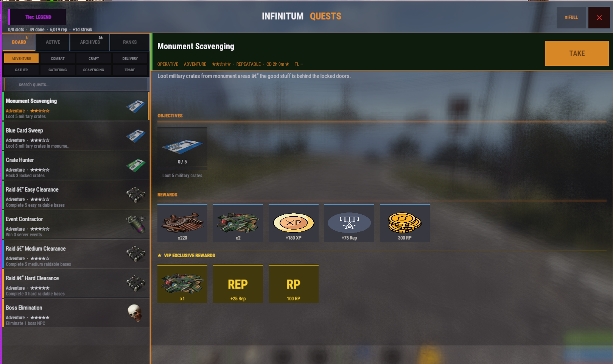
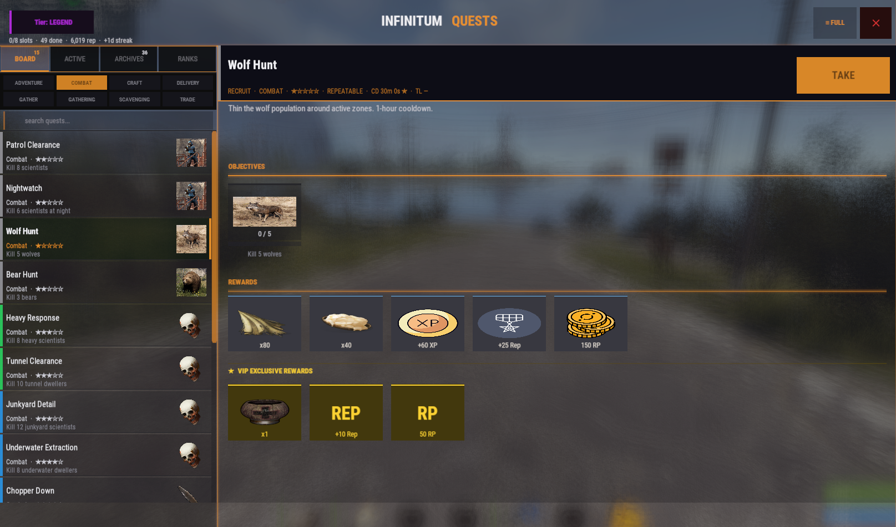
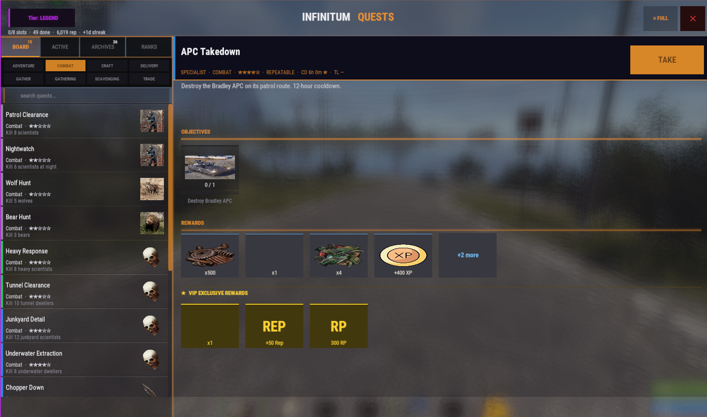
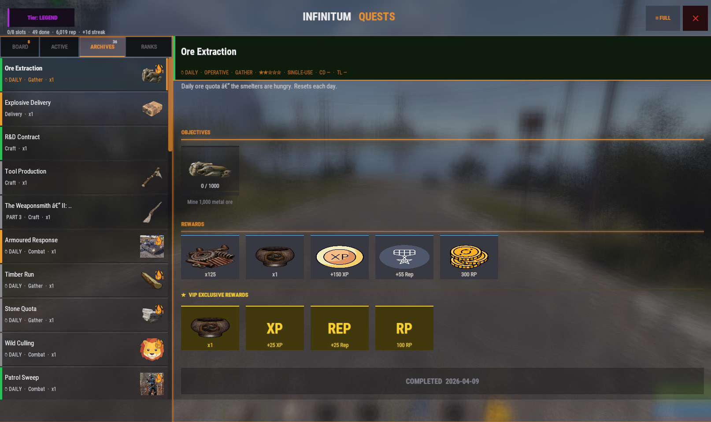
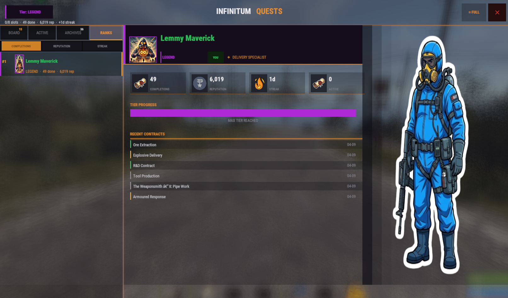
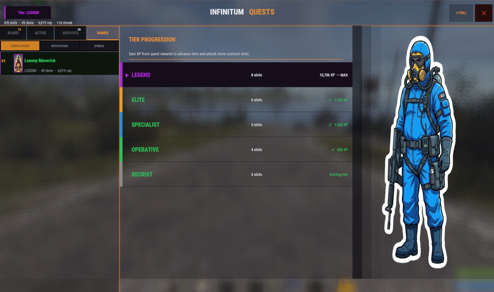
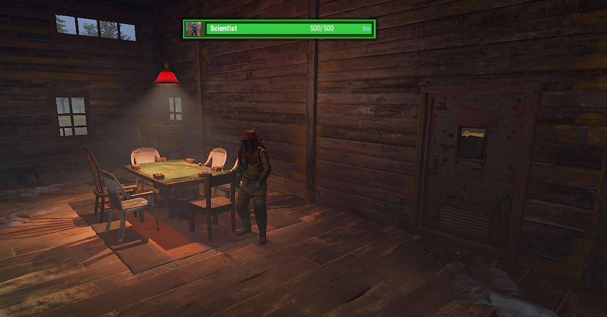
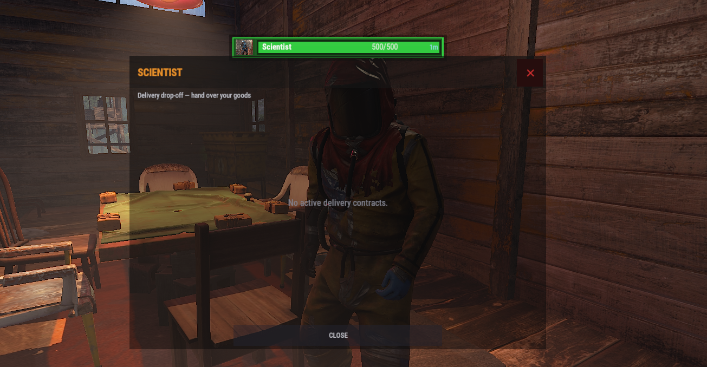
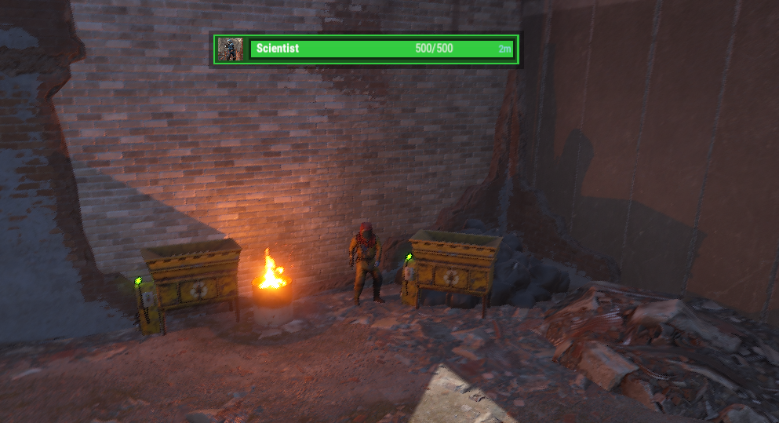

# Infinitum Quests

**Version:** 1.9.0  
**Author:** LemmyMaverick  
**License:** MIT  
**Game:** Rust (Oxide / uMod)

A contractor-style quest system with tiered rank progression, dynamic multi-objective contracts, daily streaks, chain quests, in-world Contractor NPCs, a fully custom CUI, and a live leaderboard.

---

## Screenshots

### Quest Board — Detail View

*Scavenging quest with item, XP, rep and RP rewards shown as icon cards. VIP exclusive rewards shown below.*

### Quest Board — Combat Filter

*Board filtered to Combat. Kill objective icons pulled from ImageLibrary. Custom icons per target type.*

### Quest Board — Bradley Quest

*Specialist-tier repeatable with a `+2 more` reward overflow indicator.*

### Archives — Completed Quest

*Completed daily quest in the Archives tab with completion timestamp.*

### Ranks — Player Profile

*Ranks tab: Steam avatar, tier badge, specialization label, stat blocks (completions, reputation, streak, active), recent contracts list, and decoration art.*

### Ranks — Tier Progression

*Tier Progression sub-view showing all five ranks, XP milestones, slot counts, and the active XP progress bar.*

### Contractor NPC — World

*Contractor NPC in the world with the InfinitumHealthBars health bar shown above.*

### Contractor NPC — Delivery Interaction

*Delivery drop-off UI shown when approaching the Contractor NPC with active delivery contracts.*

### Contractor NPC — Outpost Spawn

*Contractor NPC at Outpost monument spawn point.*

---

## Features

- **Tiered rank progression** — five contractor ranks (Recruit → Legend), each unlocking more active quest slots
- **Quest board UI** — filterable by tier, category, and free-text search; window or fullscreen mode
- **Rich objective types** — kills, gathering, crafting, looting, fishing, repairing, recycling, delivering, purchasing, and external event completions
- **Reward cards** — item icons, XP, reputation, and RP displayed as icon cards in the detail panel; VIP rewards shown separately
- **Daily quests** — rolling 24-hour window with configurable streak bonuses
- **Chain quests** — sequential multi-quest storylines with optional chain-completion bonus rewards
- **VIP rewards** — extra reward pool for players with the VIP permission
- **Contractor NPCs** — in-world scientists at Outpost, Bandit, Fishing Villages, and Barn; interact to open the board or drop off delivery contracts
- **HUD** — draggable mini overlay showing active contract progress; toggleable per player
- **Toast notifications** — on-screen pop-ups when objectives advance
- **Ranks leaderboard** — sortable by completions, reputation, or streak; top-3 gold/silver/bronze tinting; per-row Steam avatars; specialization label
- **Tier Progression view** — all five ranks, XP thresholds, slot counts, and a live progress bar
- **Discord webhook** — broadcasts completions to a Discord channel
- **Admin panel** — in-game UI for viewing stats and managing player quest data
- **ImageLibrary support** — custom PNG icons for kill objectives and reward types
- **External integrations** — Convoy, Harbor, Air Event, Junkyard, Supermarket, GasStation, ArcticBase, ArmoredTrain, BossMonster, RaidableBases, DungeonEvents, VirtualQuarries, InfinitumBradleyDrops, ZombieHunter

---

## Dependencies

| Plugin | Required | Purpose |
|--------|----------|---------|
| **Oxide / uMod** | Yes | Plugin framework |
| **ImageLibrary** | Optional | Custom icons for kill objectives and reward cards |
| **Economics** | Optional | Economics currency rewards |
| **ServerRewards** | Optional | RP currency rewards |
| **SkillTree** | Optional | Skill XP rewards + level-up objective tracking |
| **ZombieHunter** | Optional | Zombie kill objective tracking |

All optional plugins are auto-detected at runtime. If absent, their reward types are silently skipped.

---

## Installation

### Fresh Install

1. Copy `InfinitumQuests.cs` into `oxide/plugins/`
2. Start or reload the server (`oxide.reload InfinitumQuests`)
3. The plugin auto-generates:
   - `oxide/config/InfinitumQuests.json` — main config
   - `oxide/data/InfinitumQuests/quests/` — default quest files (2 quests per category)
   - `oxide/data/InfinitumQuests/players.json` — player progress (empty)
4. Grant permissions (see below)
5. Edit the config and quest files to suit your server
6. Run `oxide.reload InfinitumQuests` after editing quest files

### Migrating / Copying an Existing Setup

Copy these files — they survive every wipe:

```
oxide/config/InfinitumQuests.json
oxide/data/InfinitumQuests/quests/
oxide/data/InfinitumQuests/contractor_positions.json
```

Only copy this when migrating player progress (do **not** copy on a fresh wipe):
```
oxide/data/InfinitumQuests/players.json
```

After copying, reload the plugin — orphaned active quests (definitions removed since last run) are purged automatically.

### Wipe-Safe NPC Spawning

NPC positions are saved per-monument in `contractor_positions.json`. If no saved position exists for a monument, the plugin falls back to a **static anchor** (recycler, vending machine, or stablemaster). NPCs always spawn correctly on a fresh map with no manual setup required.

---

## Permissions

| Permission | Description |
|-----------|-------------|
| `infinitumquests.use` | Access the quest board |
| `infinitumquests.admin` | Open the admin panel and run admin subcommands |
| `infinitumquests.vip` | Receive VIP bonus rewards on contract completion |

```
oxide.grant group default infinitumquests.use
oxide.grant group vip     infinitumquests.vip
oxide.grant group admin   infinitumquests.admin
```

---

## Commands

### Player Commands

| Command | Description |
|---------|-------------|
| `/quest` `/quests` `/q` | Open the contract board |
| `/quest hud` | Toggle the mini HUD overlay |
| `/quest mode window` | Switch to windowed board UI |
| `/quest mode fullscreen` | Switch to fullscreen board UI |

### Admin Commands

| Command | Description |
|---------|-------------|
| `/quest admin` | Open the in-game admin panel |
| `/quest stats` | Show completion counts per quest in chat |

---

## Configuration

Key settings in `oxide/config/InfinitumQuests.json`:

| Key | Default | Description |
|-----|---------|-------------|
| `Commands to open quest board` | `["quest","quests","q"]` | Chat commands that open the board |
| `HUD enabled` | `true` | Enable the mini HUD overlay |
| `Announce completions to server` | `true` | Broadcast completions in global chat |
| `Tier XP persists through wipe` | `true` | Contractor rank carries over on wipe |
| `UI accent color (hex, no #)` | `E8912B` | Theme color for header and badges |
| `Streak indicator icon URL` | `""` | PNG icon shown on the streak stat block |
| `RP / currency reward icon URL` | `""` | PNG icon for currency reward cards |
| `Reputation reward icon URL` | `""` | PNG icon for reputation reward cards |
| `XP reward icon URL` | `""` | PNG icon for XP reward cards |
| `Ranks stat block icon URL — Completions & Active` | `""` | PNG icon for completions/active stat blocks |
| `Ranks tab decoration image URL` | `""` | Full-height character/soldier art on the right side of the Ranks panel. Transparent PNG. |
| `Discord webhook URL` | `""` | Paste your Discord webhook to enable broadcast |
| `Currency plugin` | `auto` | `auto` / `economics` / `server_rewards` / `none` |
| `Use SkillTree XP plugin` | `true` | Enable SkillTree XP rewards |
| `Use ImageLibrary for item icons` | `true` | Load icons via ImageLibrary |
| `Streak bonus percent per day` | `10` | Each consecutive daily adds this % to rewards |
| `Max streak bonus days (cap)` | `7` | Maximum days the streak bonus stacks (max +70%) |
| `Leaderboard top N players` | `20` | Players shown on the leaderboard |
| `Show objective progress toasts` | `true` | On-screen pop-up when an objective advances |
| `Toast display duration (seconds)` | `3.5` | How long each toast is visible |
| `Play sound when objectives are complete` | `true` | Audio cue when all objectives are done |
| `Play sound on reward collect / tier-up` | `true` | Audio cue on reward collection or rank-up |

### Contractor NPC Settings

| Key | Description |
|-----|-------------|
| `Enabled` | Spawn Contractor NPCs at configured monuments |
| `NPC display name` | Name shown above the NPC |
| `Clothing item shortnames` | Items dressed on the NPC |
| `Gesture` | Periodic gesture: `wave`, `thumbsup`, `shrug`, `clap`, `point`, `victory`, or `""` |
| `Gesture interval in seconds` | How often the gesture plays |
| `Greeting sound effect path` | Sound played to the interacting player |
| `Monument spawn points` | Array of `{ monument filter, anchor entity }` pairs |

Default spawn points:

| Monument filter | Anchor entity |
|----------------|--------------|
| `outpost` | `recycler` |
| `bandit` | `cardtable` |
| `fishing` | `vending` |
| `barn` | `stablemaster` |
| `ranch` | `stablemaster` |

To override a position manually: `/iq.contractor setpos <filter>` — saves to `contractor_positions.json`.

---

## Quest Files

Quest definitions live in `oxide/data/InfinitumQuests/quests/`. Each file is a JSON array of quest objects. All files in the folder are loaded on startup and on reload. You can create as many files as you like — the filename is just for organisation.

### Default Files

On first install the plugin writes these files (2 quests each):

| File | Category |
|------|----------|
| `daily.json` | Daily quests (reset each day) |
| `combat.json` | Kill objectives |
| `scavenging.json` | Loot containers |
| `repeatable.json` | Gathering repeatables |
| `adventure.json` | Monument / exploration |
| `delivery.json` | Deliver items to Contractor NPC |
| `buying.json` | Purchase from vending machines |
| `chain_fishing.json` | Fishing chain storyline |
| `chain_lumberjack.json` | Lumberjack chain storyline |
| `chain_miner.json` | Miner chain storyline |
| `chain_weaponsmith.json` | Weaponsmith chain storyline |

### Quest Schema

```jsonc
{
  "Id":                "unique_quest_id",       // Required. Must be globally unique.
  "Title":             "Contract Title",
  "Description":       "Flavor text shown in the detail panel.",
  "Tier":              "Recruit",               // Recruit | Operative | Specialist | Elite | Legend
  "Category":          "Combat",                // Any string — used for board filter tabs
  "DifficultyStars":   2,                       // 1–5 stars shown in the sidebar
  "Repeatable":        true,
  "CooldownSeconds":   7200,                    // 0 = no cooldown
  "VipCooldownSeconds":3600,                    // Shorter cooldown for VIP players
  "TimeLimitMinutes":  0,                       // 0 = no time limit
  "Permission":        "",                      // Extra permission required to accept (optional)
  "ObjectiveLogic":    "ALL",                   // ALL = all must complete | ANY = any one is enough
  "Daily":             false,                   // Resets on the player's rolling 24-hour window
  "ChainId":           "",                      // Group quests into a chain
  "ChainOrder":        1,                       // Position in the chain (starts at 1)
  "ChainTitle":        "",                      // Display name for the chain
  "RequiredQuestIds":  [],                      // Prerequisite quest IDs
  "Objectives":        [ /* see below */ ],
  "Rewards":           [ /* see below */ ],
  "VipRewards":        [ /* extra for VIP players */ ],
  "ChainBonusRewards": [ /* awarded when the full chain completes */ ]
}
```

### Objective Types

| Type | Target field | Notes |
|------|-------------|-------|
| `kill` | Entity keyword (e.g. `scientist`, `bear`, `bradley`) | Supports `HeadshotOnly`, `TimeCondition` |
| `chop` | `wood` | |
| `mine` | `stones`, `metal.ore`, `sulfur.ore`, etc. | |
| `gather` | Item shortname | |
| `craft` | Item shortname | |
| `loot` | Container keyword (`barrel`, `crate_normal`, `crate_elite`, etc.) | |
| `recycle` | Item shortname | |
| `fish` | Fish item shortname or `fish` for any | |
| `pickup` | Item shortname | |
| `harvest` | Plant / food shortname | |
| `repair` | Item shortname or `building` | |
| `deliver` | Item shortname | `Location` filters to a specific monument NPC |
| `purchase` | Item shortname | Vending machine purchases |
| `event_win` | `convoy`, `harbor`, `air`, `junkyard`, `supermarket`, `gasstation`, `arcticbase`, `armoredtrain`, or `""` for any | |
| `boss_kill` | Boss prefab name or `""` | Requires BossMonster |
| `raidable_base` | Difficulty `0`–`4` or `""` | Requires RaidableBases |
| `dungeon_win` | Map name or `""` | Requires DungeonEvents |
| `quarry_upgrade` | Profile name or `""` | Requires VirtualQuarries |
| `quarry_place` | Profile name or `""` | Requires VirtualQuarries |
| `skilltree_level` | Target level as string, e.g. `"25"` | Requires SkillTree |
| `bradley_tier` | Tier profile name or `""` | Requires InfinitumBradleyDrops |
| `zombie` | `zombie` or `zombie_hunter` | Requires ZombieHunter |

**Objective schema:**
```jsonc
{
  "Type":          "kill",
  "Target":        "scientist",
  "Count":         10,
  "Description":   "Kill 10 scientists",   // shown in the detail panel
  "HeadshotOnly":  false,                  // kill only
  "TimeCondition": "",                     // "day", "night", or "" for any
  "Location":      ""                      // deliver only: monument filter e.g. "outpost"
}
```

**Common kill targets:**

| Keyword | Matches |
|---------|---------|
| `scientist` | Standard scientists |
| `heavyscientist` | Heavy scientists |
| `tunneldweller` | Tunnel dwellers |
| `underwaterdweller` | Underwater dwellers |
| `npc` | Any NPC |
| `wolf` | Wolves |
| `bear` | Bears |
| `boar` | Boars |
| `stag` | Stags / deer |
| `chicken` | Chickens |
| `croc` | Crocodiles |
| `panther` | Panthers |
| `tiger` | Tigers |
| `animal` | Any animal |
| `bradley` | Bradley APC |
| `heli` | Patrol helicopter |
| `attack_heli` | Attack helicopter |
| `ch47` | Chinook CH47 |

### Reward Types

| Type | Required fields | Description |
|------|----------------|-------------|
| `item` | `Shortname`, `Amount`, `SkinId`, `CustomName` | Give a physical item |
| `blueprint` | `Shortname`, `Amount` | Give an item as a learned blueprint |
| `tier_xp` | `Amount` | Award Contractor rank XP |
| `reputation` | `Amount` | Award Reputation points |
| `currency` | `Amount` | Award currency via the auto-detected plugin (Economics or ServerRewards) |
| `economics` | `Amount` | Force Economics currency |
| `server_rewards` | `Amount` | Force ServerRewards RP |
| `skill_xp` | `Amount` | Award SkillTree XP |
| `command` | `Command` | Run a server console command. Use `%STEAMID%` as placeholder. |

**Reward schema:**
```jsonc
{
  "Type":       "item",
  "Shortname":  "scrap",
  "Amount":     200,
  "SkinId":     0,
  "CustomName": ""
}
```

---

## Contractor Rank System

Rank XP is earned from `tier_xp` rewards. Each rank unlocks more active quest slots.

| Rank | XP Required | Quest Slots |
|------|------------|-------------|
| RECRUIT | 0 | 3 |
| OPERATIVE | 500 | 4 |
| SPECIALIST | 1,500 | 5 |
| ELITE | 3,500 | 6 |
| LEGEND | 7,000 | 8 |

Rank XP persists through wipes when `"Tier XP persists through wipe": true`.

---

## Daily Streak System

Each day a player completes at least one daily quest, their streak increments. Streak bonuses apply as a percentage increase to all rewards on that day's completions.

- Default: **+10% per streak day**, capped at **7 days** (+70% maximum bonus)
- Streak resets if no daily is completed on a given day
- Configurable via `Streak bonus percent per day` and `Max streak bonus days`

---

## Ranks Tab

The Ranks tab has three sub-views toggled by sort chips at the top:

| Chip | Sort order |
|------|-----------|
| **Completions** | Total quests completed (default) |
| **Reputation** | Total reputation earned |
| **Streak** | Current daily streak |

Each leaderboard row shows: rank position, Steam avatar, player name, tier badge, completions, and reputation. Top 3 rows are tinted gold / silver / bronze. Selecting a row opens their full profile on the right panel.

**Right panel — Player Profile** shows:
- Steam avatar + display name
- Tier badge + specialization label (most-completed category)
- Stat blocks: Completions, Reputation, Streak, Active quests
- Tier progression bar with current XP
- Recent contracts list

**Right panel — Tier Progression** shows all five ranks with XP thresholds, slot counts, and a live progress bar.

---

## Wipe Handling

### Keep through every wipe
```
oxide/config/InfinitumQuests.json
oxide/data/InfinitumQuests/quests/
oxide/data/InfinitumQuests/contractor_positions.json
```

### Wipe on full (monthly) wipe
```
oxide/data/InfinitumQuests/players.json
```

The plugin automatically purges orphaned active quests on every load — safe to add, edit, or remove quest files at any time.

---

## Example Quest File

```json
[
  {
    "Id": "combat_patrol_clearance",
    "Title": "Patrol Clearance",
    "Description": "Eliminate roaming scientists near monuments.",
    "Tier": "Recruit",
    "Category": "Combat",
    "DifficultyStars": 2,
    "Repeatable": true,
    "CooldownSeconds": 7200,
    "VipCooldownSeconds": 3600,
    "Objectives": [
      { "Type": "kill", "Target": "scientist", "Count": 5, "Description": "Kill 5 scientists" }
    ],
    "Rewards": [
      { "Type": "item",         "Shortname": "scrap", "Amount": 150, "SkinId": 0, "CustomName": "" },
      { "Type": "tier_xp",      "Amount": 100, "SkinId": 0, "CustomName": "" },
      { "Type": "reputation",   "Amount": 40,  "SkinId": 0, "CustomName": "" },
      { "Type": "currency",     "Amount": 200, "SkinId": 0, "CustomName": "" }
    ],
    "VipRewards": [
      { "Type": "reputation",   "Amount": 14, "SkinId": 0, "CustomName": "" }
    ]
  },
  {
    "Id": "fish_01_trout",
    "Title": "The Angler — I: First Cast",
    "Description": "Every fisherman starts with a rod and patience.",
    "Tier": "Recruit",
    "Category": "Gathering",
    "DifficultyStars": 1,
    "Repeatable": false,
    "ChainId": "chain_fishing",
    "ChainOrder": 1,
    "ChainTitle": "The Angler",
    "Objectives": [
      { "Type": "fish", "Target": "fish.troutsmall", "Count": 5, "Description": "Catch 5 small trout" }
    ],
    "Rewards": [
      { "Type": "tier_xp",    "Amount": 50,  "SkinId": 0, "CustomName": "" },
      { "Type": "reputation", "Amount": 20,  "SkinId": 0, "CustomName": "" },
      { "Type": "currency",   "Amount": 150, "SkinId": 0, "CustomName": "" }
    ]
  },
  {
    "Id": "fish_02_perch",
    "Title": "The Angler — II: Yellow Perch",
    "Description": "Yellow perch are picky. Learn their waters.",
    "Tier": "Recruit",
    "Category": "Gathering",
    "DifficultyStars": 1,
    "Repeatable": false,
    "ChainId": "chain_fishing",
    "ChainOrder": 2,
    "ChainTitle": "The Angler",
    "RequiredQuestIds": ["fish_01_trout"],
    "Objectives": [
      { "Type": "fish", "Target": "fish.yellowperch", "Count": 5, "Description": "Catch 5 yellow perch" }
    ],
    "Rewards": [
      { "Type": "tier_xp",    "Amount": 65,  "SkinId": 0, "CustomName": "" },
      { "Type": "reputation", "Amount": 25,  "SkinId": 0, "CustomName": "" },
      { "Type": "currency",   "Amount": 180, "SkinId": 0, "CustomName": "" }
    ],
    "ChainBonusRewards": [
      { "Type": "item", "Shortname": "fish.troutsmall", "Amount": 10, "SkinId": 0, "CustomName": "" }
    ]
  }
]
```

---

## Changelog

| Version | Notes |
|---------|-------|
| 1.9.0 | **Stability hardening:** Progress array bounds guarded against quest definition changes mid-session. All `DateTime.Parse` calls replaced with `TryParse` — corrupt data entries discarded gracefully. External plugin reward calls (`Economics`, `ServerRewards`) now log a warning on failure. `PurgeOrphanedQuests` also prunes stale cooldown entries for deleted quests. Discord webhook JSON sanitized against newlines and special characters. FetchPlayerAvatar callback guards against ImageLibrary unload mid-fetch. **Default quests rewritten** — 2 per file, all 11 categories, matching full reward format. |
| 1.8.3 | **Ranks tab redesign:** Split layout — left 62% player profile (avatar, tier badge, specialization label, stat blocks, tier progress bar, recent contracts), right 38% configurable decoration art. Sort chips (Completions / Reputation / Streak), top-3 metallic tinting, per-row avatars. Steam avatars fetched via Community XML and cached by ImageLibrary. |
| 1.8.2 | Scroll view sidebar replacing pagination. `RefreshPanels` partial redraws on objective advance. Reward card icons with PNG support via ImageLibrary. |
| 1.8.1 | Fixed compile error on older Oxide builds. ImageLibrary bridge for async skinned reward icons. |
| 1.8.0 | Wipe-safe NPC spawn refactor — static anchor fallbacks. Skinned item reward UI. Auto-cleanup of orphan NPCs. |
| 1.7.9 | HUD move mode. Board search filter. UI state preserved across reloads. |
| 1.6.5 | Chain quests. VIP rewards. Streak bonuses. |
| 1.5.x | Contractor NPC system. Monument spawn anchors. |
| 1.4.x | External event integrations (Convoy, RaidableBases, DungeonEvents, etc.) |
| 1.3.x | Admin panel. Leaderboard. Discord webhook. |
| 1.0.0 | Initial release. |
